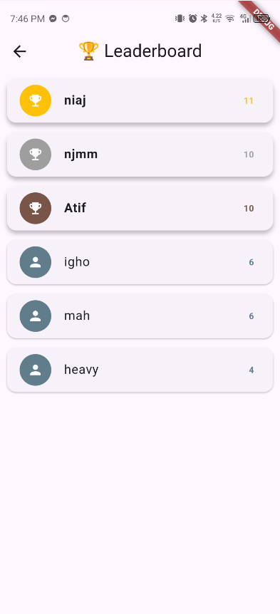

# Flutter Quiz App

A sleek offline quiz application with LaTeX support, built with **clean architecture** and modern Flutter practices.

## Features

- **Offline Quiz Experience** - Questions loaded from local JSON
- **LaTeX Math Support** - Renders mathematical equations perfectly
- **Timed Questions** - 15-second countdown per question
- **Persistent Leaderboard** - Local storage with SharedPreferences
- **Smart Dark Theme** - Follows system theme automatically
- **Smooth Animations** - Beautiful question transitions

## Architecture Highlights

**Clean Architecture + Repository Pattern**
```
lib/app/
├── core/                  # Base classes, theme, utilities
│   ├── base/              # BaseView, BaseWidget, BaseRemoteSource
│   ├── theme/             # AppTheme with system dark/light mode
│   └── utils/             # Common functions & constants
├── data/                  # Data layer abstraction
│   ├── local/             # SharedPreferences, local storage
│   ├── remote/            # Remote data sources
│   └── repository/        # Repository implementation
├── domain/                # Business logic layer
│   ├── models/            # Data models (Question)
│   ├── entities/          # Domain entities
│   └── usecases/          # Business use cases
├── presentation/          # UI & State management
│   ├── view/              # Screen widgets
│   ├── view_model/        # Provider classes
│   └── components/        # Reusable UI components
├── route/                 # App routing configuration
├── network/               # API client setup
└── provider/              # Global DI setup
```

**Quality-Focused Code:**
- **Singleton Pattern** for API client and core services
- **Repository Pattern** for clean data abstraction
- **Dependency Injection** with Service Locator pattern
- **Multi-Flavor Build** configuration ready
- **Provider Pattern** for reactive state management
- **Mixin Pattern** for reusable widget behaviors
- **Clean Separation** of concerns across layers

## Quick Start

```bash

cd flutter-quiz-app
flutter pub get

# Run the app
flutter run

# Build APK
flutter build apk --release
```

**Tech Stack:**
- Flutter 3.32.8, Dart 3.8.1
- Provider for state management
- SharedPref for leaderboard persistence
- GitHub Actions: CI/CD
- Math rendering: flutter_math_fork
- System Dark/Light theme

## Download APK

- [**Google Drive**](https://drive.google.com/drive/folders/1LD34Cxnm7plJj9YDew87icIDQDYsKEoK) 
- [**GitHub Actions**](https://github.com/niajnm/quiz-app/actions)

## Screenshots

| Home Screen | Quiz Screen | Results Screen | Leaderboard |
|-------------|-------------|----------------|-------------|
|  |  |  |  |

## Task Completion

**Core Features:**
- ✓ Home Screen with Start Quiz & Leaderboard buttons
- ✓ Quiz Flow with LaTeX support
- ✓ Results Screen with score calculation
- ✓ Leaderboard Screen with persistent storage

**Bonus Features:**
- ✓ Timed questions with countdown
- ✓ Smooth question transitions
- ✓ System-aware dark mode
- ✓ Unit tests for score calculation
- ✓ CI/CD with GitHub Actions

---

*Built with focus on code quality, clean architecture, and modern Flutter best practices.*
